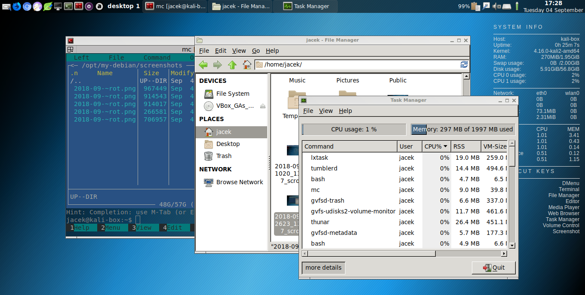
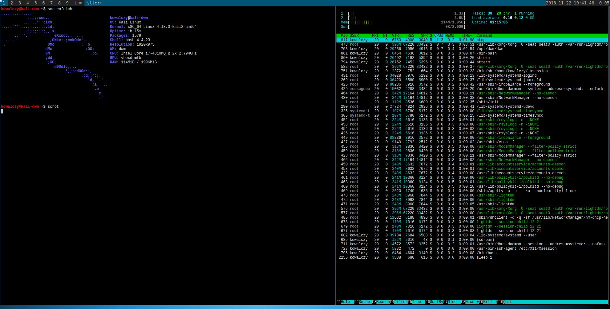

# My Custom Kali/Debian Linux Distribution 

* The goal of this project is to create custom debian or debian based distribution iso
* This repo is a place for manuals, scripts and configs. 



More screenshots [here](./screenshots/)
- - - -

#### My story 

I spent a lot of time on searching for a Linux distribution that was best suited for my needs. I wanted a very lightweight system and went about testing a ton of variants (Manjaro, Debian, Ubuntu, Sparky, MX Linux, Antix, Arch, Anarchy, Antergos, Archlabs, Bunsen Labs, and many more). I also tested different desktops environments trying to find my right fit (Xfce, LXDE, Mate, LXqt, i3, openbox, fluxbox, jwm, and IceWM). Despite this exhaustive testing, I still wasn't satisfied.

It started to become clear that for my needs, I needed a rolling release Linux that was not only lightweight, but also had good support from either a company or community. I made a long list of my favorite Linux distributions, but I still couldn't decide.

I had always wanted to take part in an open source project and do a little development. It occurred to me that my solution could be to simply create my own setup - I could take a Linux distro, install a base OS, and customize it. At first, this seemed like a great option.  But what would happen if I needed to reinstall? I didn't want to have to start over again on customizing my installed system.

I knew I wanted to create an ISO that I could use to install my system anytime, anywhere. It would be perfectly customized for my needs fresh out on install. Because of this, I started to looking for ways of customizing Debian, Arch, or Manjaro. This lead me too Kali Linux live-build config scripts. At this point, I knew I had found my solution.

Kali Linux is a rolling distro based on Debian and has great support from the Offensive Security team as well as an active community. I also found existing scripts for i3wm provided by the Kali team. That was my starting point. I started playing with the custom packages list and later on with some chroot files to be included in the ISO. In this process, I generated over 20 ISO images until I had one I was happy with. Even now, I am still continuing to improve on it.

Let me explain how I created two variants of Kali linux - one with i3wm and one with Openbox window manager.

## Custom Kali Linux with i3wm or Openbox

I did my first setup based on the official Kali documentation for [live-build-config](https://docs.kali.org/development/live-build-a-custom-kali-iso). This process was:

##### 1. Install Kali Linux. Use any official Kali image.
##### 2. Install additional packages.

```
root@kali:~# apt install curl git live-build cdebootstrap

#root@kali:~# git clone git://git.kali.org/live-build-config.git
# it seams that the url got changed
root@kali:~# git clone https://gitlab.com/kalilinux/build-scripts/live-build-config

...

root@kali:~# cd live-build-config/kali-config
root@kali:~/live-build-config/kali-config# ls
common           variant-e17    variant-i3wm  variant-light  variant-mate
variant-default  variant-gnome  variant-kde   variant-lxde   variant-xfce
```

##### 3. Start hacking i3wm/Openbox variant. I treated these as two separate builds initially, to keep things cleaner for myself. I was doing double the work, but it was easier to track. 

For i3, I started with making my modifications in the existing `variant-i3wm` folder.  For Openbox, I copied the `variant-i3wm` folder to `variant-openbox` and added my modifications to it

```
root@kali:~/live-build-config/kali-config# cp -r variant-i3wm variant-openbox
```

With that in place, the next step was to edit the file `kali-config/<VARIANT>/package-lists/kali.list.chroot` to add the required packages I wanted. My list of packages for i3wm can be found [here](variant-i3wm/package-lists/kali.list.chroot), and Openbox [here](variant-openbox/package-lists/kali.list.chroot). All config files for the livecd should be copied to `kali-config/common/includes.chroot/root/`. This directory is used by the livecd as the livecd environment is running as the root user.

All config files for the installed file system should be copied to `kali-config/common/includes.chroot/etc/skel/`. The `/etc/skel` directory in commonly used as a template for creating user home directories, so every new user will by default have the files that are located in this directory. 

Nitrogen is an application used to setup wallpaper. The file `.config/nitrogen/bg-saved.cfg` defines the set wallpaper. The second file `.config/nitrogen/nitrogen.cfg` is the main configuration file for nitrogen and defines the directories where the wallpaper images are located. I tweaked each of these out to fit my preferences. With that in place, I then also tweaked the power manager applet by configuring `.config/xfce4/xfconf/xfce-perchannel-xml/xfce4-power-manager.xml`.

Additionally, I made a range of other customizations to personalize the system a bit more. Without going into too much detail, there were:

* For i3wm
	* `kali-config/common/includes.chroot/root/.i3wm_conkyrc` - configuration for conky tool. This conkyrc file is based on the conky  configuration from Sparky Linux (https://sparkylinux.org/)
	* `kali-config/common/includes.chroot/root/.config/i3/config` - the configuration file for i3wm was generated for me on the fist login to i3wm session, and I added there few changes to autostart other tools like: nitrogen, clipit, volume control, and defined my key bindings for my tools and actions (poweroff and reboot). 
* For Openbox
	* `kali-config/common/includes.chroot/root/.openbox_conkyrc` - configuration for conky. The openbox conkyrc is a different from the one for i3wm. This one is based on the conkyrc file from CrunchBang++ (https://crunchbangplusplus.org/). 
	* `kali-config/common/includes.chroot/root/.config/openbox/autostart` - Openbox autostart file defines which tools and applications should be started automatically with openbox session: (nitrogen, clipit, volume vontrol, power manager, conky). I based it on the file from CrunchBang++ also. 
	* `kali-config/common/includes.chroot/root/.config/openbox/menu.xml` - This is the Openbox menu config, controlling what happens when you right click on the desktop. Openbox is really unique in that this file is completely user controlled and you can run scripts in it and do other things like starting applications or even to view the status the media player application in dynamic pipe menu. Openbox is really powerfull. 
	* `kali-config/common/includes.chroot/root/.config/openbox/rc.xml` - Openbox window manager themes and keybindings. This is pretty stock, but I added there my keybindings for my favourite tools and actions like poweroff and reboot. 
	* `kali-config/common/includes.chroot/root/.config/tint2/tint2rc` - tint2 panel settings and launchers. Here, I added my most commonly used tools: terminal, editors, web browsers. To edit this file I used tint2conf gui application. This application allows to easily define the themes of the tint2 panel and add lunchers and orther items of the panel. 

All those changes for i3wm can be found [here](https://gitlab.com/jacekkowalczyk82/my-debian/i3/etc/skel/) and for Openbox can be found [here](https://gitlab.com/jacekkowalczyk82/my-debian/openbox/etc/skel/).

I also added the Firefox developer edition browser by downloading the install package and unpacking it into `kali-config/common/includes.chroot/opt/firefox/` and then added the toxic tox client to `kali-config/common/includes.chroot/opt/toxic`. To start up Firefiox, I added also the shell script `kali-config/common/includes.chroot/usr/bin/firefox.sh`.

```
#!/bin/bash

echo "Starting firefox developer edition"

/opt/firefox/firefox

```

At the end I modified the debian installer configuration (kali-config/common/includes.installer/preseed.cfg) to allow to create standard user account during the installation process 

```
# Do not create a normal user account
d-i passwd/make-user boolean true 

```

##### 3.1 Tweak Live build framework configs to be able to generate 32bit image and to create standards user account

```
diff --git a/auto/config b/auto/config
index 991eada..4018e85 100755
--- a/auto/config
+++ b/auto/config
@@ -75,7 +75,7 @@ case "$arch" in
        lb_opts="$lb_opts --debian-installer live"
     ;;
     i386)
-       lb_opts="$lb_opts --debian-installer live --linux-flavours 686-pae"
+       lb_opts="$lb_opts --debian-installer live --linux-flavours 686"
     ;;
     armel|armhf)
        lb_opts="$lb_opts --binary-images hdd --binary-filesystem ext4 --chroot-filesystem none"
diff --git a/kali-config/common/includes.installer/preseed.cfg b/kali-config/common/includes.installer/preseed.cfg
index 31fffa9..720424b 100644
--- a/kali-config/common/includes.installer/preseed.cfg
+++ b/kali-config/common/includes.installer/preseed.cfg
@@ -32,7 +32,7 @@ d-i pkgsel/upgrade select full-upgrade
 # d-i netcfg/get_hostname seen false

 # Do not create a normal user account
-d-i passwd/make-user boolean false
+d-i passwd/make-user boolean true

 # Enable eatmydata in kali-installer to boost speed installation
 d-i preseed/early_command string anna-install eatmydata-udeb

```

##### 4. Build ISOs

With all that configuration out of the way, it was time for the fun part, building the ISOs!

```
root@kali:~/live-build-config/kali-config# ./build.sh --distribution kali-rolling --variant i3wm --verbose

root@kali:~/live-build-config/kali-config# ./build.sh --distribution kali-rolling --variant openbox --verbose

#for 32 bit 
root@kali:~/live-build-config/kali-config# ./build.sh --distribution kali-rolling --variant openbox --verbose  --arch i386	


```

With those running, I then had to wait for the job to finish. In my case it took about 3 hours. The ISO files it generated were saved in the `images` subfolder.

## Final Version

In the final version of the configs, I decided to port my i3wm install to my Openbox build. This way, when building the Openbox config, I am getting both window managers, Openbox and i3. On the login screen, I can select the session I want. Obviously, its much easier to have one "perfect" ISO than have to decide between the two at install time. 

## Final Version - Kali Linux DWM Openbox i3 variant

I wanted to try even something lighter then openbox. I installed DWM (Dynamic Window Manager from suckless.org) and prepared config files for new ISO. See this [manual](./debian-dwm.md) for more info. 



I prepared some automation scripts so right now I can build new ISO using commands: 

```
cd /opt/my-debian
sudo ./build-dwm.sh |tee -a build-dwm-`date '+%Y-%m-%d'`.log
sudo ./build-openbox.sh |tee -a build-dwm-`date '+%Y-%m-%d'`.log
sudo ./build-mate_openbox.sh |tee -a build-mate-openbox-`date '+%Y-%m-%d'`.log
sudo ./build-i3wm.sh |tee -a build-i3wm-`date '+%Y-%m-%d'`.log

```

Right now user of the installed system can choose which "desktop" to use: DWM, Custom-DWM, Openbox or i3. 

## About the Kali Linux DWM Openbox i3 variant

More info about installed applications and basic help is [here](./dwm_openbox_i3/about.md). 


## Issues and solutions

#### Installing pcmanfm and getting the LXQT desktop 

This happened very early in the project. I decided to avoid the problem by not installing pcmanfm file manager

#### While installing, the installer complained that kernel modules did not match the installer kernel version. 

I started investigating the issue and wanted to get an updated Debian installer from Debian buster. The next day I found out that Kali linux was upgrading the kernel packages, but they had not updated the installer and netboot images yet. Two days later it was OK. Debian installer and netboot were updated at Kali linux repos and everything worked fine. The only negative was that I needed to rebuild the iso. 

## Recommended post install setup

I decided to install a few packages after completing the installation. I noticed that when I added pcmanfm to the list of packages to generate an ISO, I got a system with preinstalled LXqt. It seems likely that some scripts install more than the bare minimum, and will include recommended packages.

```
apt install lxappearance pcmanfm smplayer mplayer mpv vlc audacious lxinput lxrandr xarchiver galculator gpicview evince retext scite


sudo apt install gpicview
sudo apt install evince
sudo apt install lxrandr
sudo apt install dtrx # tool for extracting multiple archive types
sudo apt install snapd

#snaps
sudo snap install vscode --classic
snap run vscode

sudo snap install notepadqq

sudo snap install slack --classic
sudo snap install vlc
sudo snap install clementine

#appImage
https://kate-editor.org/get-it/
or 
sudo snap install --edge kate

```


## issue with some missing toollbars, icos in few GUI apps: retext, kate

```
libGL error: pci id for fd 6: 80ee:beef, driver (null)
libGL error: No driver found
libGL error: failed to load driver: (null)
Using configuration file: /home/kowalczy/.config/ReText project/ReText.conf

libGL error: pci id for fd 14: 80ee:beef, driver (null)
libGL error: No driver found
libGL error: failed to load driver: (null)


```


## Debian Stretch and Buster custom ISO

Building custom Kali Linux ISO gave me enough of experience to start thinking about building pure Debian Linux custom ISO. 

Raw notes for how to build custom Debian with DWM are [here](./debian-stable-readme.md).

